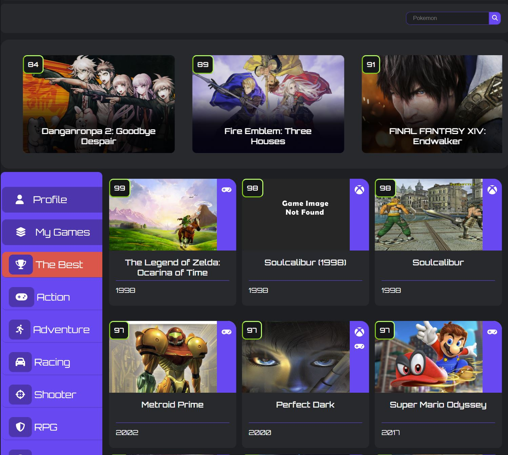
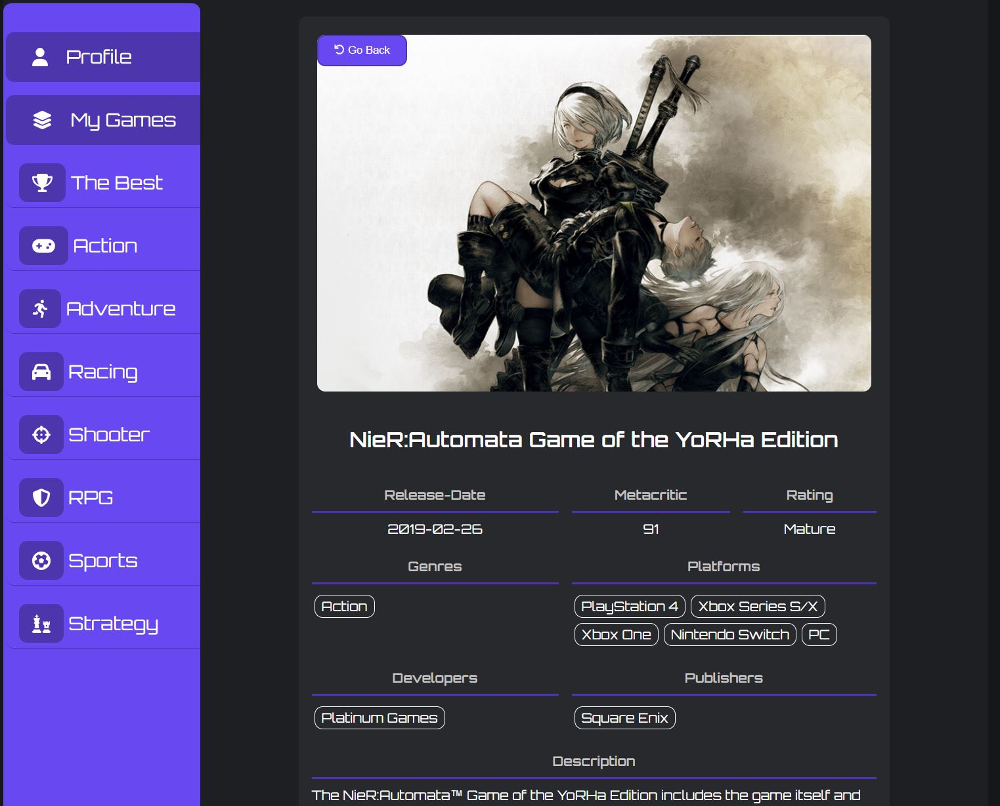
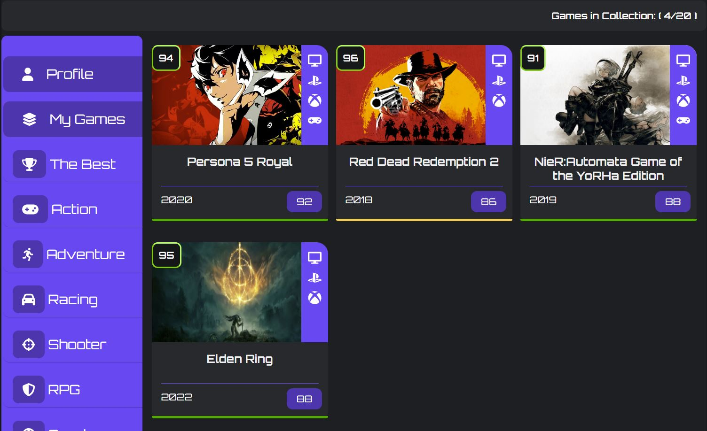

# Gamer-Data

This is an app where user's can look up information on video games using an api from RAWG. The user's can also create a collection of games they own and record the games they have played or own. This project was a follow on from the animi-data and bug tracking app using their different concepts. From anini-data That project was mainly using an api and displaying the information on my website. Bug tracking app I worked with a database getting and sending data to my database. I combined both of them by getting information from the api and storing information users selected to add to their collection.

## Tools

- React
- JSX
- JavaScript
- Firebase
- TanStack Query

## Deployment

The site is deployed on [Render](https://gamer-data.onrender.com/)

## Preview

Few Screenshots of the app.





Here is a sample of how I set up game cards UI.

```css
.game-information-card-text
 {
   display: grid;
   padding: 1rem;
   gap: 1rem;
   grid-template-areas: 
   "game-information-title game-information-title game-information-title game-information-title"
   "game-information-title game-information-title game-information-title game-information-title"
   "game-information-form game-information-form game-information-form game-information-button"
   "game-information-release game-information-release game-information-score game-information-rating"
   "game-information-genre game-information-genre game-information-platforms game-information-platforms"
   "game-information-dev game-information-dev game-information-pub game-information-pub "
   "game-information-details game-information-details game-information-details game-information-details " ;
 }

```

I added a quick sort for sorting out games
```js
export const qsGames = (games, value, low, high) => {
  if (low > high) {
    return;
  }
  const pivotIndex = partition(games, value, low, high);

  qsGames(games, value, low, pivotIndex - 1);
  qsGames(games, value, pivotIndex + 1, high);
  return games;
};

function partition(games, value, low, high) {
  const pivot = games[high][value];
  let i = low - 1;

  for (let j = low; j <= high - 1; j++) {
    if (games[j][value] >= pivot) {
      i++;
      [games[i], games[j]] = [games[j], games[i]];
    }
  }
  [games[i + 1], games[high]] = [games[high], games[i + 1]];
  return i + 1;
}
```

## Lessons learned

- How react renders and when information will be displayed on the page, I learnt a lot from this project as I didn't fully understand how rendering worked. 
- Using React with a backend (Firebase) and Api. This took a most of my time as trying to sort data from one place to another and pick the best solutions to provide me the best answers. 
- Understanding how firebase stores information. I'm familiar with MongoDB and SQL databases but firebase did it a bit different and I had to get my head around the new way to get data. 
- Using useEffect less for API calls and instead using react query. 

## Potential future features

- See other users games collection if public to other users. 

## Working on

- Adding more a11y functionality. 
- Cleaning up error handling.  
- Clean up li accessibility and logout button.  

## Bugs
- Need to update error handling.
